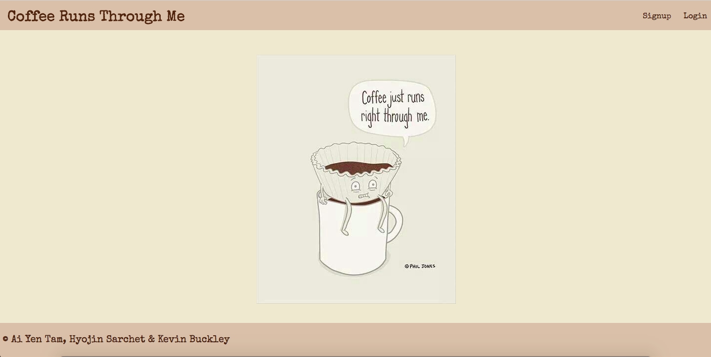

# Coffeerunsthroughme-Frontend

### About the project

* This is the group project (Ai Yen, Kevin, and Hyojin) in the Web Development Immersive Program from GA.
* It is the front-end repository of a full stack MERN application called
  Coffee-Runs-Through-Me.
* There is the Express based back-end repository [here](https://github.com/KBuck2018/coffeerunsthroughme-backend).
* It has complete CRUD functionality implemented with RESTful routes.

### How to use this application

* Users can create their profiles and track of how much caffeine they consume daily.
* Users can see their saved drinks.
* Users can edit and delete their saved drinks.
* Users also can see some fun facts about caffeine.

### How to run

* Clone this repository and open it on local server
  (http://localhost:3000/)
* Click [here](deployed links here).

### Used tools in the project

| Front-End  |
| :--------: |
|   React    |
| JavaScript |
|    Html    |
|    CSS     |

### The main page look

