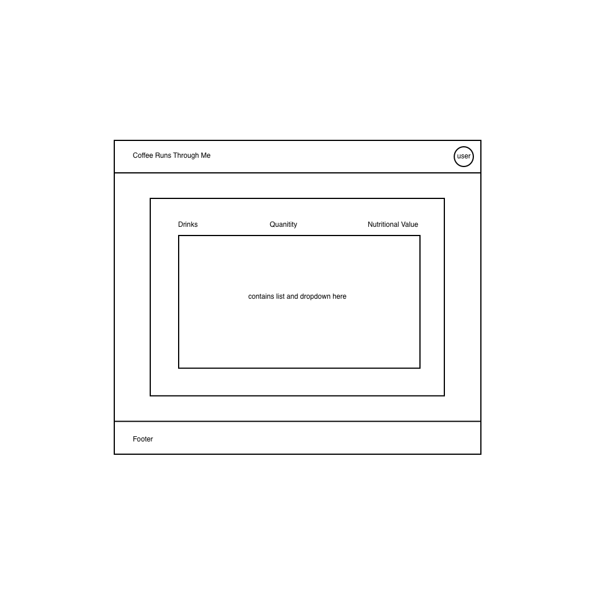
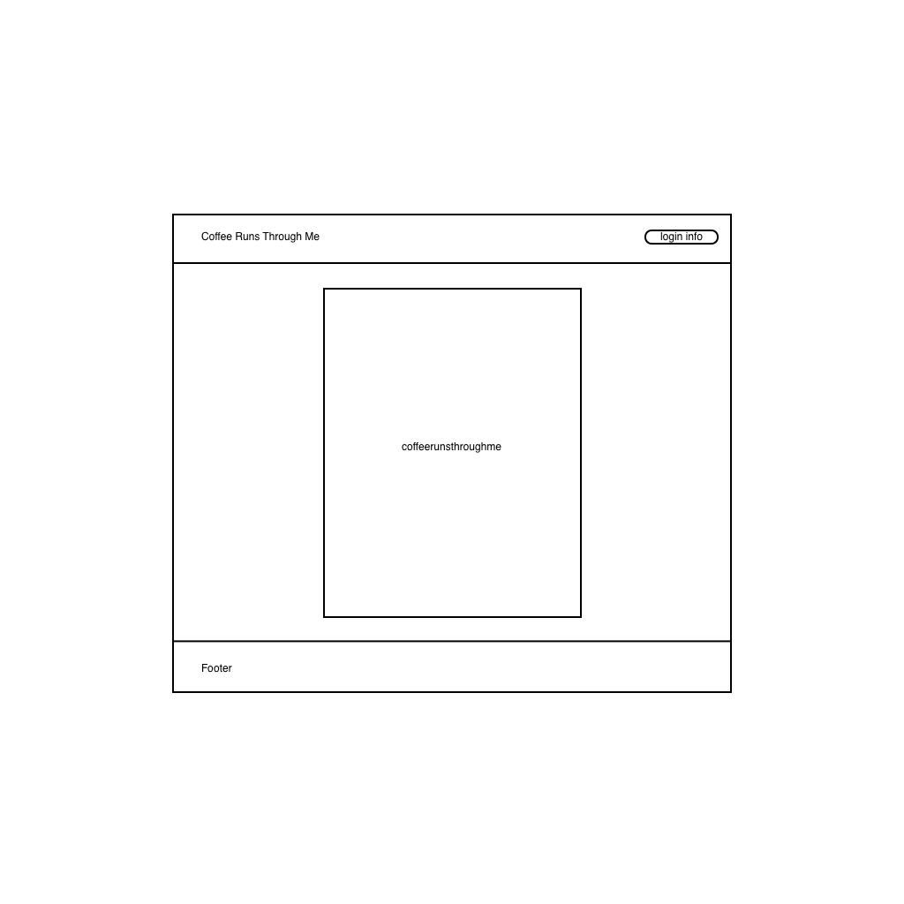

# Planning the Coffeerunsthroughme project

### About the project

* This is the group project (Ai Yen, Kevin, and Hyojin) in the Web Development Immersive Program from GA.
* It is the full stack application with a React front-end and Express back-end.
* It has complete CRUD functionality implemented with RESTful routes.
* This application is deployed to Heroku and GitHub(Surge)

### What we are building:

This is a Coffee-runs-through-me app. It has the following features:

* Create a drink and save it to the database.
* View my selected drinks and other people's.
* Edit a drink.
* Delete a drink.
* User authentication (Sign up, Sign in, Sign out)

### User stories / List of Features

* As a User, I want to create and save my drinks, so that I can keep track of how much caffeine I consume daily.
* As a User, I want to read/see my drinks, so that I can compare mine with other people's and can compare how much caffeine is in other users' favorite drinks.
* As a User, I want to edit my drinks, so that I can update my caffeine consumption.
* As a User, I want to delete my drinks, so that I can hide my consumption from my profile.

### MVP

* ability to select and create my drink list.
* ability to see my drinks.
* ability to submit my choice of drinks.

### Bronze

* Sign up, Sign in, Sign out.
* ability to edit drinks.
* ability to delete drinks.

### Silver

* ability to track and compare my drink selection with other people's.
* user profile showing their drink history.
* user profile showing their daily caffeine consumption on a graph.

### Gold

* ability to comment on users' profiles.
* ability to add more drink selection.

### Used tools in the project

| Front-End |  Back-End  |
| :-------: | :--------: |
|   React   |    Node    |
|   Html    |  Express   |
|    CSS    |  Mongoose  |
|           |  MongoDB   |
|           | Handlebars |

### Wireframes

